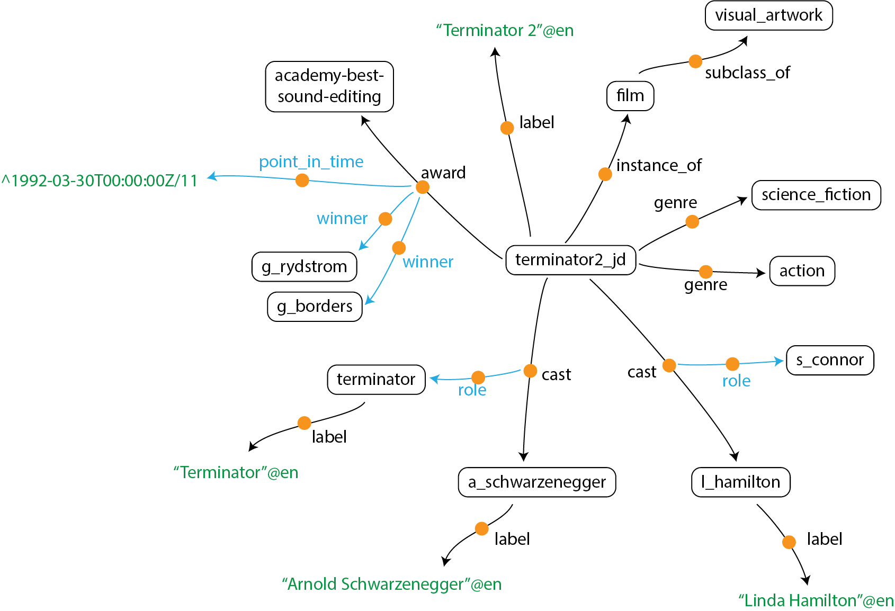

# KGTK Data Model

The KGTK data model represents knowledge graphs (KG) as a set of nodes and edges, as shown in the figure below that shows a partial KG for the Terminator 2 movie. KGTK uses nodes to represent entities (e.g., `terminator2_jd` or `action`), literals (e.g., `"Terminator 2"@en`), dates (e.g., `^1992-03-30T00:00:00Z/11`) and other types of literals (see full specification). A notable feature of KGTK is that edges are also nodes, depicted in the figure using the orange circles. Given that edges are nodes, it is possible to define edges that connect edges to other nodes, as illustrated using the blue arrows.

For example, we can represent that the terminator movie received an academy award for best sound editing by using an edge labeled `award` between `terminator2_jd` and `academy-best-sound-editing`. We can represent that the award was given on March 30, 1992 by using an edge labeled `point_in_time` from the award edge to `^1992-03-30T00:00:00Z/11`, and we can also represent that the award was given to Gary Rydstrom and Gloria Borders using two additional edges labeled `winner`.

