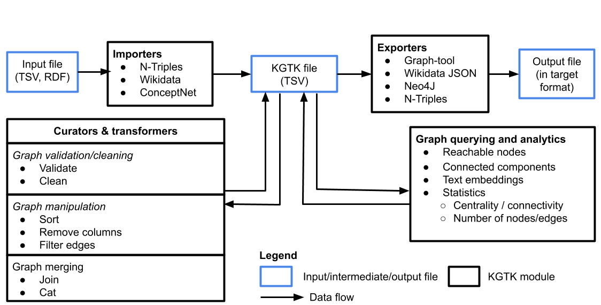

# Knowledge Graph Toolkit (KGTK)

KGTK is a Python library for easy manipulation with knowledge graphs. It provides a flexible framework that allows chaining of common graph operations, such as: extraction of subgraphs, filtering, computation of graph metrics, validation, cleaning, generating embeddings, and so on. Its principal format is TSV, though we do support a number of other inputs.



**Figure 1**: Overview of the usage workflow and features included in KGTK.


## Features

* Import/output files in commonly used data formats (TSV, N-Triples, Neo4J, etc.)
* Curators and transformers to validate, join, filter, sort and concatenate KGTK files
* Graph querying and analytics over knowledge graphs: reachable objects, centrality, text embeddings, page rank, etc.
* A framework for composing multiple KG operations, based on Unix pipes. The framework uses the KGTK file format on the standard input and output to combine tools written in different programming languages

## How to cite

```
@inproceedings{ilievski2020kgtk,
  title={{KGTK}: A Toolkit for Large Knowledge Graph Manipulation and Analysis}},
  author={Ilievski, Filip and Garijo, Daniel and Chalupsky, Hans and Divvala, Naren Teja and Yao, Yixiang and Rogers, Craig and Li, Ronpeng and Liu, Jun and Singh, Amandeep and Schwabe, Daniel and Szekely, Pedro},
  booktitle={International Semantic Web Conference},
  pages={278--293},
  year={2020},
  organization={Springer}
  url={https://arxiv.org/pdf/2006.00088.pdf}
}
```
