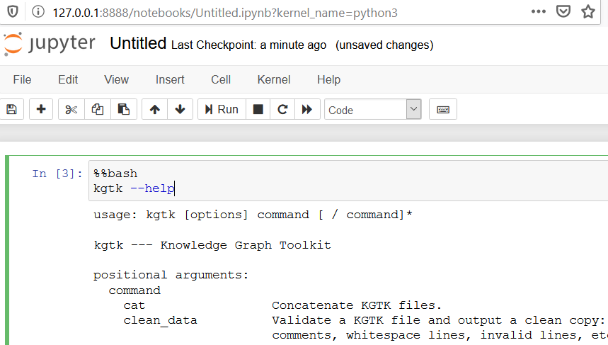

## Testing KGTK with MyBinder
The easiest, no-cost way of trying out KGTK is through [MyBinder](https://mybinder.org/). We have made available several **example notebooks** to show some of the features of KGTK, which can be run in two environments: 

* Basic KGTK functionality: This notebook may take 5-10 minutes to launch, please be patient. Note that in this notebook some KGTK commands (graph analytics and embeddings) **will not run**. To launch the notebook in your browser, click on the "Binder" icon: [](https://mybinder.org/v2/gh/usc-isi-i2/kgtk/master?filepath=examples%2FExample5%20-%20AIDA%20AIF.ipynb)

* Advanced KGTK functionality: This notebook may take 10-20 minutes to launch. It includes basic KGTK functionality and **graph analytics and embedding capabilities** of KGTK:  [](https://mybinder.org/v2/gh/dgarijo/kgtk/dev?filepath=%2Fkgtk%2Fexamples%2FCSKG%20Use%20Case.ipynb)

For executing KGTK with large datasets, **we recommend a Docker/local installation**.

## Using KGTK with Docker

If you have Docker installed, we have prepared a Docker image with KGTK:

```bash
docker pull uscisii2/kgtk
```

To run KGTK in the command line type:

```bash
docker run -it --rm  --user root -e NB_GID=100 -e GEN_CERT=yes -e GRANT_SUDO=yes uscisii2/kgtk:latest /bin/bash
```

Note: if you want to load data from your local machine, you will need to [mount a volume](https://docs.docker.com/storage/volumes/).
For example, to mount the current directory (`$PWD`) and launch KGTK in command line mode:

```bash
docker run -it --rm -v $PWD:/out --user root -e NB_GID=100 -e GEN_CERT=yes -e GRANT_SUDO=yes uscisii2/kgtk:latest /bin/bash
```

If you want to run KGTK in a **Jupyter notebook**, mounting the current directory (`$PWD`) as a folder called `/out` then you will have to type:

```bash
docker run -it -v $PWD:/out -p 8888:8888 uscisii2/kgtk:latest /bin/bash -c "jupyter notebook --ip='*' --port=8888 --no-browser"
```

You will see a message similar to:

```bash
[C 22:36:40.418 NotebookApp]

    To access the notebook, open this file in a browser:
        file:///root/.local/share/jupyter/runtime/nbserver-1-open.html
    Or copy and paste one of these URLs:
        http://092260f3740e:8888/?token=83945df95e9b1f5f7594597d3925960fc89dbefaed4ada7d
     or http://127.0.0.1:8888/?token=83945df95e9b1f5f7594597d3925960fc89dbefaed4ada7d
```

Copy the localhost URL (in the case above `http://127.0.0.1:8888/?token=83945df95e9b1f5f7594597d3925960fc89dbefaed4ada7d`, this is random every time) and paste it in your browser. In order to run KGTK commands in a notebook, remember to add `%%bash` in the line before your command, as shown below:

```bash
%%bash
kgtk --help
```

As a result, now you should be able to see a help message similar to the one depicted below:



!!! note
    if you want to load data from your local machine or save the results obtained with KGTK, you will need to [mount a volume](https://docs.docker.com/storage/volumes/) as described above. **Notebooks stored inside the container will be erased after the container finishes its execution**.

!!! note
    Older versions of KGTK (0.3.2 and 0.2.1) require `--allow-root` as part of the jupyter notebook command `jupyter notebook --ip='*' --port=8888 --allow-root --no-browser`

More information about all available versions and tags is available here: [https://hub.docker.com/repository/docker/uscisii2/kgtk](https://hub.docker.com/repository/docker/uscisii2/kgtk). For example, the `dev` branch is available at `uscisii2/kgtk:latest-dev`.

## Installing KGTK from pip

**Before you start**:  Our installation will use a conda environment. If you don't have a conda installed, follow this [link](https://docs.conda.io/projects/conda/en/latest/user-guide/install/) to install it.

1. Set up your own conda environment:
```
conda create -n kgtk-env python=3.7
conda activate kgtk-env
```
 **Note:** Installing Graph-tool is problematic on python 3.8 and out of a virtual environment. Thus: **the advised installation path is by using a virtual environment.**

1. Install: `pip install kgtk`

You can test if `kgtk` is installed properly now with: `kgtk -h`.

3. Install `graph-tool`: `conda install -c conda-forge graph-tool`. If you don't use conda or run into problems, see these [instructions](https://git.skewed.de/count0/graph-tool/-/wikis/installation-instructions). 

## Updating your KGTK installation
To update your version of KGTK, just follow the instructions below:

- If you installed KGTK with through Docker, then just pull the most recent image: `docker pull <image_name>`, where `<image_name>` is the tag of the image of interest (e.g. uscisii2/kgtk:latest)
- If you installed KGTK from pip, then type `pip install -U kgtk`.
- If you installed KGTK from GitHub, then type `git pull && pip install` . Alternatively, you may execute:  `git pull && python setup.py install`. 
- If you installed KGTK in development mode, (i.e., `pip install -e`); then you only need to do update your repository: `git pull`.


## Running KGTK commands

To list all the available KGTK commands, run:

```
kgtk -h
```

To see the arguments of a particular commands, run:

```
kgtk <command> -h
```

An example command that computes instances of the subclasses of two classes:

```
kgtk instances --transitive --class Q13442814,Q12345678
```
